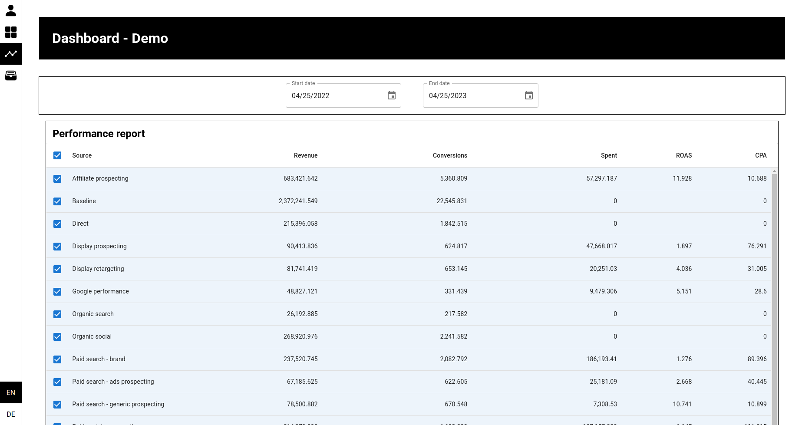

# Technical assignment: Web application - BingeBook

## Task
- Create ReactJS dashboard with that presents different aspects of the database
- Visual aspect should be the key focus
- Use provided API endpoint and documentation
- 1 week to complete

## Hosted on
- https://d3s1so5f4st6ml.cloudfront.net

## Set API page

Desktop            |  Mobile
:-------------------------:|:-------------------------:
 |  

## Partition selection page

Desktop            |  Mobile
:-------------------------:|:-------------------------:
 |  

## Dashboard page

Desktop            |  Mobile
:-------------------------:|:-------------------------:
 |  

Desktop            |  Mobile
:-------------------------:|:-------------------------:
 |  

Desktop            |  Mobile
:-------------------------:|:-------------------------:
 |  

## Partition data page

Desktop            |  Mobile
:-------------------------:|:-------------------------:
 |  
